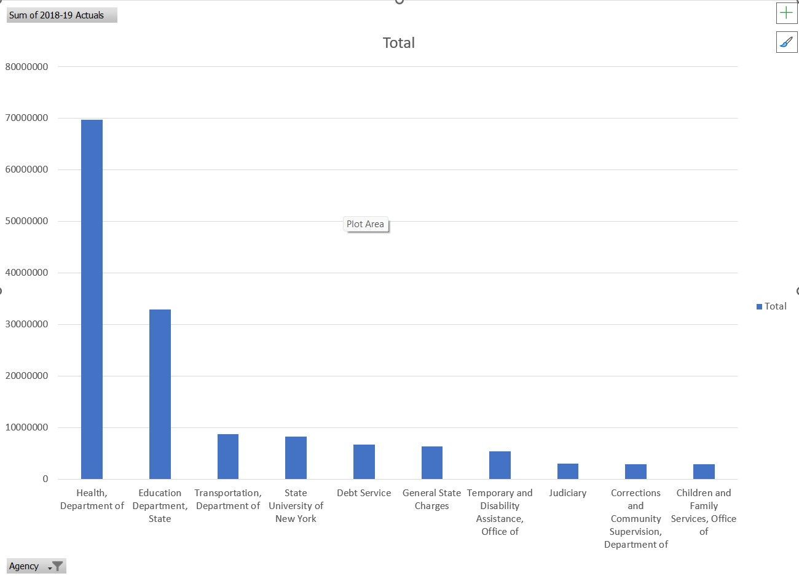

## New York Budget Analysis

## Project Overview
 Analyzed New York City Actuals Vs Returns data from 1994-95 through 2018-2019

 ## Explored
 - Total yearly spending trends
- Top agencies by expenditure
- Agency spending comparisons over time

##  Analysis Highlights
1. **Yearly Spending Trends**  
   - Created line charts showing how spending evolved over fiscal years.
2. **Top Agencies (2018–19)**  
   - Bar chart ranking the highest-spending agencies for the latest year.
3. **Agency Comparisons Over Time**  
   - Pivot chart to compare spending patterns of selected agencies across multiple years.

## Visuals

## You can also explore the interactive analysis directly in Google Sheets: 
[Open In Google Sheets](https://docs.google.com/spreadsheets/d/1BlB8Y-oRA2FI43g58QAzgAG8N2324u1zXmChZgaYx9U/edit?usp=sharing)

  
  

  
